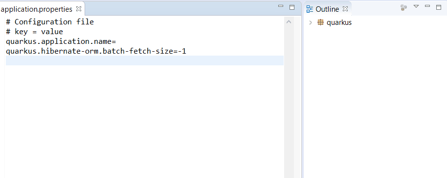

This project is a POC which consumes the [Quarkus LS](https://github.com/redhat-developer/quarkus-ls) inside Eclipse IDE with LSP4E to provides support for Quarkus properties inside application.properties.

Please note this POC should be integrated in JBoss Tools. 

Here a demo:

If you wish to play with this POC:

 * install LSP4E
 * import in your workspace com.redhat.quarkus.lsp4e which is starts Quarkus LS with LSP4E (server side).
  * import in your workspace com.redhat.quarkus.jdt.core wich uses JDT Search to collect Quarkus properties from a given project (client side). You will have compilation problem with QuarkusDelegateCommandHandler because this class has dependency to JDT LS (used only in vscode context) but it's not a problem. 
  * launch a second Eclipse Workspace (by starting the MANIFEST.MF of com.redhat.quarkus.jdt.core)
  * import a Quarkus project in the second workspace and open an application.properties.
  
You should have completion, hover, validation, outline for the application.properties.   

Any feedback are welcome! Enjoy!
  